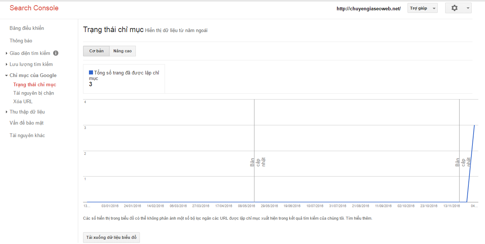
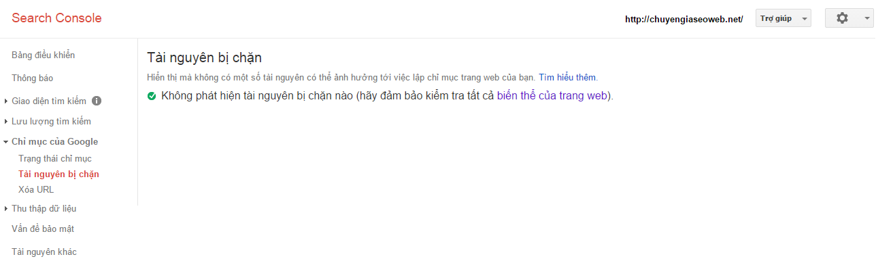

## GOOGLE WEBMASTER TOOL

> Tài liệu: Google Webmaster Tool
>
> Người thực hiện: Lê Tú Trinh
>
> Cập nhập lần cuối: 09/12/2016

### Mục lục:

[1. Tìm hiểu về Google Analytics](#1)

- [1.1. Khái niệm](#1.1)

- [1.2. Tính năng](#1.2)

- [1.3. Công dụng](#1.3)

- [1.4. Cách sử dụng](#1.4)

[2. Tìm hiểu về Google Webmaster Tool](#2)

- [2.1. Khái niệm](#2.1)

- [2.2. Công dụng](#2.2)

- [2.3. Các thành phần](#2.3)

[Tài liệu tham khảo](#100)

---

### 1. Tìm hiểu về Google Analytics:

#### 1.1 Khái niệm:

**Google Analytics (GA)** là công cụ phân tích web miễn phí cung cấp số liệu thống kê và phân tích cơ bản để người quản trị dựa vào đó tối ưu hóa các mục đích kinh doanh và tiếp thị. Được xây dựng dựa trên **Software as a Service (SaaS)** - công cụ phân tích lưu thông web của Urchin.

#### 1.2 Các tính năng:

- Các công cụ trực quan dữ liệu và biểu đồ chuyển động, hiển thị các thay đổi dữ liệu theo thời gian.

- Phân đoạn thị trường để phân tích các tập con.

- Chia sẻ email và truyền thông.

- Tích hợp các sản phẩm khác của google: AdWords, Public Data Explorer và Website Optimizer.

Google Analytics chỉ phù hợp cho những trang web vừa và nhỏ.

#### 1.3 Công cụ của Google Analytics:

Google Analytics giúp hiểu sâu hơn về giá trị mạng xã hội, các kênh giới thiệu (backlink), cách thức làm việc và hoạt động của kênh tiếp thị để tạo doanh số bán hàng và chuyển đổi phù hợp, theo dõi hoạt động xảy ra trên trang web, ngăn chặn các nguồn truy cập không mong muốn.

#### 1.4 Cách sử dụng:

Cài đặt Google Analytics cho blogspot:

- Tạo tài khoản trên Google Analytics, sau đó điền đầy đủ các thông tin và yêu cầu cần thiết, sau khi hoàn thành thì chấp nhận thỏa thuận với google sau đó ta sẽ có giao diện như sau:

- Chúng ta có 2 đoạn code sau:

- Vào trang quản trị web chọn **Appearance** -> **editor**. Tìm file `footer.php` và copy đoạn code trên dán vào, sau đó upload file.

- Để kiểm tra đã cài đặt thành công hay chưa thì chọn **Báo cáo**->**thời gian thực**->**Tổng quan** để xem có bao nhiêu lượt truy cập vào trang web của bạn

- Sau khi cài đặt thành công cần chú ý những tính năng sau: 
	+ Thời gian thực
	+ Đối tượng
	+ Sức thu hút

- Thời gian thực: 
	+ Tổng quan: cho biết người dùng đang truy cập tại trang nào, nguồn truy cập từ đâu, truy cập bằng thiết bị gì...
	+ Nội dung: Số lần xem trang 30 phút cuối cùng để biết số trang được truy cập nhiều nhất

- Đối tượng:
	+ Tổng quan: xem số phiên người dùng hoạt động trên cùng 1 trang. Hiện tại vẫn chưa có gì hết !!!
	+ Người dùng đang hoạt động: xem số người hoạt động trong 1 ngày, 7 ngày...

 
 
 

- Sức thu hút:
	+ Referral: backlink(link click từ các forum)
	+ Social: mạng xã hội(facebook...)
	+ Origanic Search: google search
	+ Direct: trực tiếp( vào thẳng url)

### 2. Tìm hiểu về Google Webmaster Tool:

#### 2.1 Khái niệm:

**Google Webmaster Tool** là công cụ giúp bạn theo dõi và duy trì sự hiện diện của trang web trong kết quả tìm kiếm của google, theo dõi và tối ưu web, phát hiện và ngăn chặn các tác động xấu đến web.

#### 2.2 Công dụng:

Giám sát hiệu suất của trang web, bao gồm:

- Chắc chắn Google có thể truy cập nội dung của bạn

- Gửi nội dung mới cho bọ tìm kiếm và loại bỏ các nội dung mà bạn không muốn hiển thị trong kết quả tìm kiếm

- Tạo và theo dõi nội dung cung cấp kết quả tìm kiếm trực quan hấp dẫn

- Duy trì trang web của bạn với gián đoạn tối thiểu để tìm kiếm hiệu quả

- Theo dõi và giải quyết các phần mềm độc hại hoặc các vấn đề thư rác

Khám phá cách tìm kiếm của người dùng đến trang web của bạn:

- Những truy vấn đến web của bạn xuất hiện trong kết quả tìm kiếm.

- Các trang web được liên kết đến trang web của bạn.

- Tối ưu giao diện web trên di động cho du khách tìm kiếm trên điện thoại di động.

Các thành phần quan trọng bao gồm:

- Sitemaps

- Crawler Access

- Sitelinks

- Change of Address

- Settings

#### 2.3 Các thành phần:

#### Dashboard Google Webmaster Tools - Bảng điều khiển:

.png)

- Tình trạng hiện tại (current Status): Thông báo các lỗi về thu thập dữ liệu, cho biết tổng quan về trạng thái DNS, server connection, robotss, số lượng URL bot của google đã tìm kiếm trên website của bạn, hay số lượng url không được truy cập và url lỗi mà bot của google đã quét trên website của bạn.

- Phân tích tìm kiếm (Search analytics): Cho biểu đồ thống kê số lượng click trong các ngày

.png)

- Sơ đồ trang web(sitemaps): Cho thông tin URL của website bạn đã submit và số URL mà google đã index thành công

.png)

#### Messages Google Webmaster Tool- Tin nhắn của google:

Sẽ có 2 dạng tin nhắn như sau:

- Tin vui: Tin nhắn chúc mừng như số lượng click hay traffic của trang website của bạn tăng cao, hay update để fix lỗ hổng thành công

- Tin buồn: Thông báo website đã bị tấn công bởi các phần mềm độc hại

**Setting Google Webmaster Tool - thiết lập cấu hình cho webmaster tool:**

Tại cài đặt chọn **search console preferences** sau đó click vào ô trống để google gởi email thông báo 

.png)

- Vào **cài đặt trang web** bên góc phải để tiến hành cài đặt trang web:

.png)

- Ở đây ta có **tên miền ưu thích**(preference domain) nghĩa là bạn có muốn hiển thị alias "www" trong tên miền trên công cụ tìm kiếm của google hay không. Ngoài ra **tốc độ thu thập dữ liệu**( crawl rate) giúp thiết lập mức độ thuwongd xuyên thu thập dữ liệu cho bót của google.  

.png)

- Thay đổi địa chỉ (change of address): sử dụng nếu quyết định thay đổi domain của mình sang tên miền mới, việc cấu hình thay đổi này sẽ giúp cho google index lại các bài viết trên website nhanh hơn việc đợi bót của google tự phát hiện.

- Google Analytics Property: Cho phép bạn liên kết google webmaster tool với google analytics để hiển thị dữ liệu google webmaster tool trong google analytics

Chúng ta có thể chọn liên kết với google webmaster tool hoặc tạo tài khoản mới của google analytics để liên kết tại đây

- Users and Property Owners (người dùng và chủ sở hữu thuộc tính): google sẽ liệt kê danh sách người có thẩm quyền trên công cụ webmaster tool.

Đồng thời cho phép tạo thêm user mới và cấp quyền cho họ được sủ dụng tính năng nào trên google webmaster tool.
	+ Chỉ có khả năng xem cấu hình dữ liệu
	+ Không thể submit sitemaps
	+ Không thể xóa URL
	+ Chỉ có khả năng xem xét các lỗi thu thập dữ liệu và thông báo phần mềm độc hại...

 

 - Verification Details (Chi tiết xác minh): cho biết những người quản lí google webmaster tool được thông báo xác minh thành công.

 

 - Associates: phần ngày cho biết bạn đã liên kết với các tài khoản google của các dịch vụ khác với goolge webmaster tool, các tài khoản này sẽ không nhìn thấy dữ liệu của google webmaster tool nhưng có thể thực hiện 1 số hành động như: tạo tài khoản youtube cho website của bạn, gởi bài viết của bạn lên google

 

 #### Google webmaster tool structured data

 **Search Appearance:**

 - Sructured data( cấu trúc dữ liệu): giúp cho google hiểu rõ cấu trúc và nội dung của trang web mình hơn, giúp cho google có thể dễ dàng hơn trong việc thu thập dữ liệu website của mình.

 Structured data giúp cho website của mình tăng xếp hạng và lượt truy cập. Chức năng cấu trúc dữ liệu trong google webmaster tool cho phép người dùng có thể gỡ bỏ các lỗi liên quan đến cấu trúc dữ liệu dễ dàng

 

 - Data highlighter( đánh dấu dữ liệu): có chức năng đánh dấu dũ liệu cho phép bạn giúp google xác định 1 số cấu trúc dữ liệu trên website mà không cần code để xác định.

 

 - HTML Improvements: thông báo cho bạn các vấn đề, cảnh báo, lỗi liên quan đến thẻ title và thẻ Desscription, đây là 2 thẻ thành phần duy nhất trong trang web bị quy định về số lượng kí tự. HTML Improvements sẽ chỉ ra lỗi liên quan đến vấn đề trên và tìm cách khắc phục vấn đề đó.

 

#### Sitelink google webmaster tools

#### Sitelink là gì?

Đây là liên kết trang web giúp tăng khả năng điều hướng người dùng trên công cụ google search, giúp quảng cáo và nâng cao uy tín của website

Khi website có 1 page mà lượt truy cập nhiều, có uy tín, thẩm quyền với từ khóa cụ thể thì google search sẽ hiện 1 loạt các link phụ vì cho rằng những link đó quan trọng trên website của mình.

- Tối đa 4 sitelink với website có trả phí

- Tối đa 6 sitelink với website có kết quả tìm kiếm tự nhiên

#### Lợi ích của Sitelinks:

- Áp đảo đối thủ giành vị trí trang đầu của google

- Người dùng có thể di chuyển nhanh đến các thành phần chính của website

- Giúp tăng lượt truy cập với từ khóa xác định 

- Giúp tăng độ uy tín của website với người search

#### Cách để có sitelinks:

- Sitelink được tạo ra bởi thuật toán của google và không ai biết cách xác định chính xác sitelinks của google

- Việc sitelink có xuất hiện trên google search là tùy thuộc vào đánh giá của google về website của bạn. Google chỉ hiển thị sitelinks trong bẳng kết quả tìm kiếm khi google cho rằng nó phù hợp và hữu ích với người dùng

**Các yếu tố quan trọng ảnh hưởng đến việc google có hiển thị sitelink hay không:**

- Website của bạn phải có vị trí top cao với từ khóa nhất định trên google search
- Số lượng người tìm kiếm với từ khóa nhất định sẽ nhấp vào trang bạn những kết quả hiển thị trên google search
- Số lượng backlink trỏ tới website của bạn vơi từ khóa tìm kiếm xác định trong các liên kết backlink đặt trong Anchor text
- Website phải có sự phân cấp rõ ràng tạo điều kiện thuận lợi cho các Bots của google thu thập thông tin trên trang web của bạn
- Sử dụng sitemap với các thiết lập priority cho các mục mà cần hiển thị sitelinks
- Nội dung page phải chất lượng, thông tin phong phú, hữu ích
- Đảm bảo các thẻ tiêu đề có các ALT TEXT, có các mô tả chính xác, không bị trùng lặp với các pages khác.
- Bao gồm các pages quan trọng trên menu của pages chính của website.
- Sử dụng Breadcrumbs và đánh dấu chúng bằng Schema.org
- Trong trường hợp website của bạn rớt hạn xuống top 7 thì sitelinks của bạn sẽ bị mất.

#### Demote sitelinks:

Google webmaster tool cung cấp tính năng cho phép giảm hạng sitelinks nào không cần thiết. Việc sitelinks bị giảm cấp có hồi phục hay không tùy thuộc vào nhiều vấn đề nữa.

Việc sử dụng Demote SiteLinks cho một URL của Sitelink chỉ có tác dụng trong 90 ngày. Nếu sau 90 ngày mà URL đó vẫn được quan tâm nhiều thì vẫn có thể trở lại thành một SiteLink. Vì vậy, bạn nên kiểm tra Sitelink thường xuyên để kịp thời sửa chữa và khắc phục SiteLink theo ý của bạn.

#### Google webmaster tool search traffic:

#### Search Analytics:

Webmaster tool có nhiều ưu điểm hơn so với Google Analytics về những thống kê hiển thị và nội dung tìm kiếm website của bạn. Nếu Google Analystic cho phép bạn xem tổng quan về số lượng khách truy cập, họ sử dụng từ khóa nào của website bạn để truy cập vào website bạn thì Webmaster Tool còn cho bạn biết các từ khóa được click bao nhiêu lần, thứ hạng các từ khóa của website bạn, những từ khóa nào dẫn đầu số lần hiển thị.

#### Internal Links:

Đây là những liên kết nội bộ trong trang web, 1 trang web có càng nhiều internal links càng tốt. Internal giúp bạn phân tích đánh giá chéo các liên kết trong 1 trang và cấu trúc 1 trang, 1 trang quan trọng nên có nhiều liên kết từ các trang khác về nó nhiều hơn. Nếu trang web không có internal link thì trang web đó sẽ trở thành Orphaned. Vậy nên cần liên kết trang đó lại với website của bạn hoặc chuyển đến 1 trang thích hợp.

#### Google index là gì?

#### Index Status Google webmaster tools:

Google index cho biết google đã index( lập chỉ mục) cho bao nhiều trang của website bạn, còn cho biết bao nhiêu page của website bị block, không cho Bots đi đến và index.

#### Content Keywords:

Content Keyword cho biết tất cả từ khóa được bạn thường xuyên sử dụng trên toàn bộ website của mình, những từ khóa này được google webmaster tool xếp hạng từ cao xuống thấp theo tỉ lệ từ khóa đó. (tức là số lần xuất hiện từ khóa đó trong toàn bộ website). Việc từ khóa của bạn xuất hiện trong bảng xếp hạng Content Keywords rất quan trọng và ảnh hưởng đến kế hoạch SEO từ khóa đó của bạn.

#### Blocked Resouces:

Cho biết những resouce hay những URL đang bị chặn trên website của mình.

#### Remove URLs:

Công cụ Remove URLs cho phép remove 1 URL trên trang web của mình, có thể loại bỏ URL trên website ngay cả khi URL đó đã được goole index. Remove URLs trên Google webmaster Tool chỉ là Remove URL đó tạm thời trong khoảng 3 tháng và nếu link đó còn tồn tại thì Google sẽ index lại. Muốn remove URL và không cho google index lại thì có thể sử dụng the meta và khai báo “noindex” trong rebots hoặc sử dụng Disallow URL.

#### Google webmaster tool crawl:

##### Google Webmaster Tool Crawl:

- Site Errors: Tính năng Site Errors trong Google Analystic dùng để thu thập các thông tin lỗi. Site Errors sẽ hiện thông tin chi tiết về URL bị lỗi trong quá trình Google Bot thu thập thông tin không thành công do URL của trang web bạn bị lỗi. Google sẽ gửi mã phàn hồi trang lỗi 404 và chuyển hướng trang lỗi 301.

- **Số liệu thống kê thu thập dữ liệu cho biết**:
	+ Số trang được thu thập dữ liệu hàng ngày
	+ Số kilobyte được tải xuống mỗi ngày
	+ Thời gian để tải xuống 1 page

Các yếu tố ảnh hưởng đến Crawl Stats như:

- Tốc độ kết nối từ máy chủ G sẽ chỉ mục website mình đến máy chủ / hosting đặt website

- Cấu trúc, dữ kiện định hướng cho bot

- Cấu trúc mã HTML trong nội tại web-page

- Số lượng liên kết outbound của web-page

- Headers của web-page

- Nén dữ liệu trước khi truy xuất (GZIP compression)

- Cache của từng yếu tố trong nội tại web-page (html, css, js, flash, hình ảnh v.v..)

- **Fetch as Google**: Tìm nạp như google- mô tả cách thức hoạt động của Google Bot đọc website của mình.

Fetch as Google sẽ cho bạn xem chi tiết HTTP, thời gian ngày và giờ, mã HTL và 1000 KB văn bản (text) hiển thị đầu tiên của trang của bạn.

Nếu trang hiển thị đã OK thì bạn có thể submit lên cho Google Index trang đó của bạn.

- **Robots.txt Tester**:  là tính năng cho phép bạn ngăn chặn các URL mà bạn không muốn cho Google Bots thu thập thông tin của trang đó và những vùng nào cho phép Google Bots được phép truy cập, thu thập thông tin từ website của bạn. Robots.txt còn được sử dụng để gỡ bỏ các URL được được Google Index khởi công cụ tìm kiếm nếu URL của trang đó có chứa các thông tin mà bạn không muốn người dùng tìm thấy trên công cụ tìm kiếm.

- **Google webmaster tool Sitemaps**: Là công cụ hỗ trợ Google Bot nhận biết đc sitemap của website bạn, các Bots sẽ nhanh chóng thu thập thông tin dựa trên sitemap đã submit.

- **Google webmaster tool URL Parameters:**

##### Google webmaster Tools Security Issuses: 

Tính năng này cho biết website của mình có bị nhiễm phần mềm độc hại nào không. Các phần mềm độc hại có thể được đính kèm khi người dùng tải trang web của bạn xuống, ảnh hưởng đến vị trí của website bạn trên công cụ tìm kiếm, thay vì truy cập vào website của bạn thì người dùng nhận được một thông báo rằng website của bạn có chứa mã độc gây hại.

### Tài liệu tham khảo:

> [1] SVUIT Forum. Google webmaster tools
>
> Online: http://svuit.vn/threads/bai-3-1-google-webmaster-tools-la-gi-1426/
>
> [2] Giang Nguyen. SEO với Google webmaster tools
>
> Online: http://www.phanmemseo.vn/huong-dan-seo/1300-seo-voi-google-web-master-phan-1-cai-dat-google-web-master.html
>
> [3] Lê Vương Nam. Tổng quan vể Google analytics và Google webmaster tool
>
> Online: http://www.levuongnam.com/2015/08/tong-quan-ve-google-analytics-va-google-webmaster-tool.html

---
